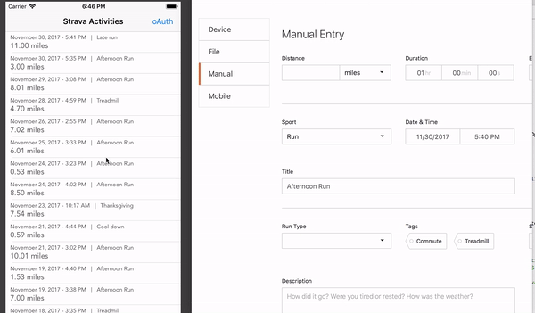
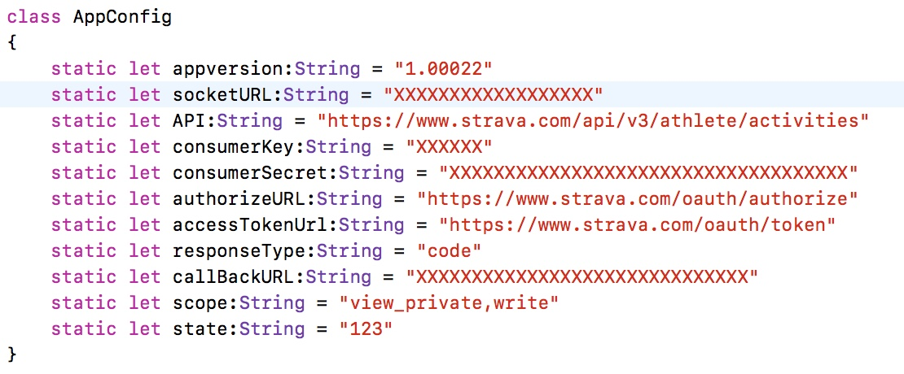

Notes:

*** my AppSecret token is not inside the app. I wasn't sure what the protocol was for that for sample projects ***

Node.js (serverside)
For the webhooks portion there is a serverside code in order to create webhook subscriptions and a destination URL to receive the webhook POST events. 
The Strava webhook will notify subscribed applications and users who have given permission, when an activity has been added. Following a user adding an activity, the Strava webhook will fire that will make a an API call to the node.js server and then emit an event to that the iOS app has registered for ('activities updated'). I used a live server in this example, but someone testing can make use of ngrok or ultrahook to test if they need to run the server on their local machine as localhost.
In addition to the server emitting events on the API call. a GET function 'stravasubscriptions' is made available to the Strava server to hit when a subcription is created. This simple API call returns a random token named 'hub.challenge' to provide proof of the endpoint.
Webhook notifications are emitted using Socket.IO with a namespace called 'activitiesUpdated' emitted. (This part could be taken a little further, if the application calls for only specific userIDs receiving their own events if all user updates are not relevant to every subscriber.)

**Setup**

Run the following command to set up the server.

```
npm install
node app.js
```

iOS (clientside)
The application starts out with an empty UITableView and a navigation button that allows the user to commence the oAuth2 process making use of oAuthSwift. A new webview is revealed and the user can login and give permission to read Strava data to the app. Once that is handled a token is stored in the app. For simplicity, it's stored using UserDefaults. A more secure storage is in keychain, but I felt it was creeping outside the scope of the project.  With permission granted to the app, webhooks are enabled and the token available is available for a Strava API call to gather activities. Retrieved data is parsed using the new Swift4 JSON decoding method. 
To receive webhook events shortly after they are fired from the server, SocketIO has been added and an observer for 'activitiesUpdated' from the server.

iOS Configuration

We will create a file inside our iOS project called 'AppConfig.swift' to handle the authorization URLs, keys, client IDs that will be used throughout the project. It should mirror the following:




